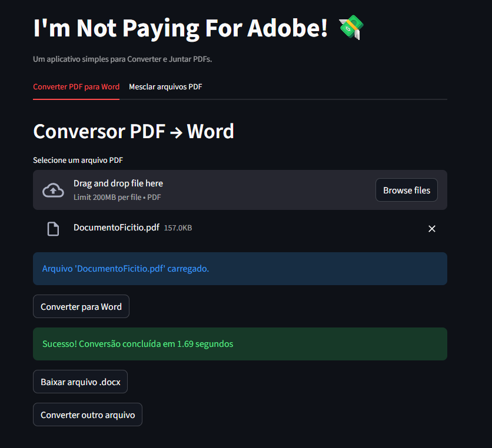

# I'm Not Paying For Adobe Acrobat 💸

Um aplicativo web simples criado em Python e Streamlit para realizar tarefas comuns de PDF, como conversão e mesclagem, sem depender de serviços pagos.

## 🚀 Recursos

  * **Converter PDF para Word (.docx):** Converte seus arquivos PDF em documentos Word editáveis.
  * **Mesclar PDFs:** Junte múltiplos arquivos PDF em um único documento.
  * **Interface Simples:** Arraste e solte seus arquivos, processe e baixe os resultados.
  * **Gerenciador de Arquivos:** Uma barra lateral mostra todos os arquivos na pasta `upload`, permitindo baixar e deletar arquivos individuais.

## 🛠️ Tecnologias Utilizadas

  * **Python**
  * **Streamlit** (para a interface web)
  * **pdf2docx** (para a conversão de PDF para Word)
  * **pypdf** (para a mesclagem de PDFs)
  * **PyMuPDF** (dependência principal para leitura de PDF)

## ⚡ Como Executar Localmente

Siga estes passos para rodar o projeto na sua máquina.

1.  **Clone o repositório:**

    ```bash
    git clone https://github.com/SEU-USUARIO/im-not-paying-for-adobe-acrobat.git
    cd im-not-paying-for-adobe-acrobat
    ```

2.  **Crie e ative um ambiente virtual (Recomendado):**

    ```bash
    # Windows
    python -m venv venv
    .\venv\Scripts\activate

    # macOS/Linux
    python3 -m venv venv
    source venv/bin/activate
    ```

3.  **Instale as dependências:**
    (Certifique-se de que seu arquivo `requirements.txt` está atualizado)

    ```bash
    pip install -r requirements.txt
    ```

4.  **Execute o aplicativo Streamlit:**
    (O arquivo principal do Streamlit deve se chamar `main.py`)

    ```bash
    streamlit run app.py
    ```

5.  **Pronto\!** O aplicativo será aberto automaticamente no seu navegador no endereço `http://localhost:8501`.

## 🖼️ Visualização

